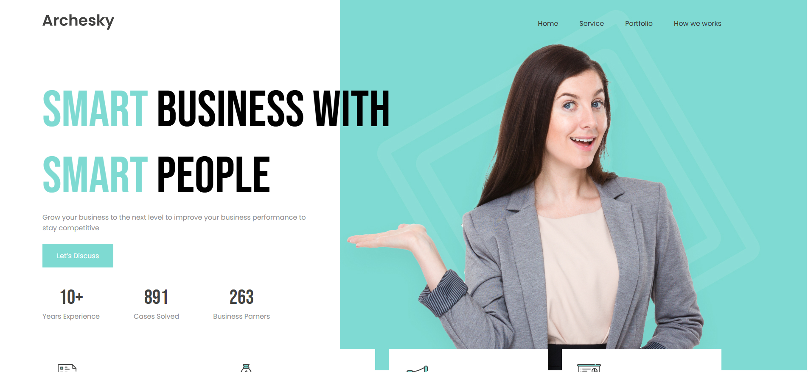

<h1 align="center">🏢 Business_Agency</h1>

<p align="center">
  Proyecto Frontend desarrollado como práctica de maquetación siguiendo los cursos de Conquer Blocks.
</p>

<p align="center">
  Construido con HTML, CSS y SCSS
</p>

---

<p align="center">


</p>

---

## ✨ Sobre el proyecto

**Business_Agency** es una cabecera web (*Header Component*) desarrollada para poner en práctica conceptos fundamentales de desarrollo frontend.

Este proyecto fue construido aplicando conocimientos adquiridos durante la formación de **Conquer Blocks**, utilizando una metodología orientada a escribir código más limpio, organizado y reutilizable mediante **SCSS**.

Durante el desarrollo se trabajó en:

✅ Estructura semántica con HTML  
✅ Diseño y maquetación con CSS  
✅ Organización de estilos usando SCSS  
✅ Componentización visual  
✅ Buenas prácticas de desarrollo frontend  

---

## 🎯 Objetivo

Crear una cabecera moderna para una página tipo **Business Agency**, simulando una interfaz profesional enfocada en:

- Navegación clara
- Diseño visual atractivo
- Organización del código
- Escalabilidad mediante SCSS

---

## 🚀 Tecnologías

<div align="center">

| Tecnología | Uso |
|-----------|------|
| 🌐 HTML5 | Estructura |
| 🎨 CSS3 | Estilos |
| ⚡ SCSS | Arquitectura y mantenimiento |

</div>

---

## 📷 Preview

<p align="center">
  
</p>


---

## 🛠️ Ejecución local

Clona el repositorio:

```bash
git clone https://github.com/EdgarMadrid/Business_Agency.git
```

Accede al proyecto:

```bash
cd Business_Agency
```

Abre `index.html` en el navegador.

### Compilar SCSS

```bash
sass --watch scss:css
```

---

## 📚 Inspiración

Proyecto realizado como práctica académica siguiendo la formación de **Conquer Blocks** y enfocado en reforzar habilidades de desarrollo frontend.

---

## 👨‍💻 Autor

<p align="center">

<a href="https://github.com/EdgarMadrid">

</a>

<a href="https://www.linkedin.com/in/emadrid110">

</a>

</p>

---

<p align="center">
⭐ Si te gustó este proyecto puedes darle una estrella en GitHub
</p>
